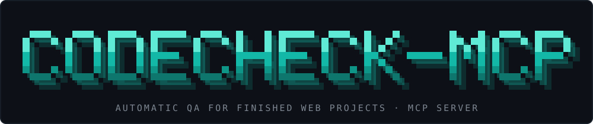

<p align="center">
  
</p>

<h1 align="center">CodeCheck MCP</h1>

<p align="center">
  <a href="#installation">Install</a> ·
  <a href="#tools">Tools</a> ·
  <a href="llms-install.md">For AI agents</a> ·
  <a href="CONTRIBUTING.md">Contributing</a> ·
  <a href="SECURITY.md">Security</a>
</p>

<p align="center">
  <a href="LICENSE"></a>
  
  
  <a href="README.md"></a>
  <a href="README.ru.md"></a>
</p>

An MCP server that **tests a finished web project by itself**: it opens the site in a real browser (Playwright),
clicks the buttons, looks at the layout at five screen widths, checks fonts, images and basic security, and hands
your AI agent a summary plus a `report.md` with screenshots where every problem is outlined in red.

Tested on Windows and Python 3.14. Other operating systems and Python versions have not been tested.

| | |
|---|---|
| **A real browser** | Chromium via Playwright: real clicks, real layout, real fonts. Nothing is guessed from the source code. |
| **Finds what users see** | Dead buttons, overlapping or clipped text, horizontal scroll, low contrast, broken images, mismatched fonts. |
| **Evidence, not opinions** | Each finding comes with a screenshot and a CSS selector. Only measurable rules, no "looks ugly" verdicts. |
| **Light security pass** | Secrets in files and git history, `.env` in git, missing security headers, insecure cookies. |
| **Safe by design** | Read-only for your project, isolated browser context, external navigation blocked, secrets masked in reports. |

## Installation

You need Python 3.10+ and an internet connection (Chromium is about 150 MB).

```bash
# 1. Create an environment and install straight from GitHub
python -m venv codecheck-env
codecheck-env/Scripts/pip install git+https://github.com/aleks-fw/CodeCheck-MCP.git      # Windows
# codecheck-env/bin/pip install git+https://github.com/aleks-fw/CodeCheck-MCP.git        # macOS / Linux

# 2. Download the browser for Playwright (once)
codecheck-env/Scripts/python -m playwright install chromium
```

### Connect to Claude Code

```bash
claude mcp add --scope user codecheck -- "<path>/codecheck-env/Scripts/codecheck-mcp"
```

### Connect to other clients (Claude Desktop, Cursor, ...)

```json
{
  "mcpServers": {
    "codecheck": {
      "command": "<path>/codecheck-env/Scripts/codecheck-mcp"
    }
  }
}
```

`<path>` is the absolute path to the folder where you created the environment. Restart the client and `codecheck`
appears in its MCP list.

### If you are an AI agent

Install by following [llms-install.md](llms-install.md).

## Usage

Just tell your agent, for example: "Run full_qa on `D:\my-site`" or "Run test_layout on https://example.com at
widths 375 and 1440". `target` is a URL or a path to a project folder or file (for a folder, a temporary local
server is started).

## Tools

| Tool | What it checks |
|---|---|
| `full_qa(target, max_pages=10)` | Everything below in one go |
| `test_interactions(target)` | Dead buttons; disabled controls that still react; things that look clickable but do nothing; covered buttons; forms that submit with empty required fields; double click sending a request twice; broken anchors and placeholder links |
| `test_layout(target, widths=[...])` | At 320/375/768/1024/1440 px: overlapping text, clipped text, horizontal page scroll, text contrast (including text on images), small tap targets |
| `test_fonts(target)` | Number of font families, outlier fonts, web fonts that failed to load, font-size sprawl, heading hierarchy |
| `test_images(target)` | Broken, stretched, blurry and heavy images, missing `alt` |
| `quick_security(target)` | Secrets in files and git history, `.env` tracked by git, no `.gitignore`; for URLs: CSP, HSTS, X-Frame-Options, nosniff, Referrer-Policy, plain HTTP, mixed content, cookie flags |

Reports are written to `~/codecheck-reports/<date-time>/report.md`. Change the folder with the
`CODECHECK_REPORTS_DIR` environment variable.

## What it does not do

- It does not judge whether photos match their captions: only measurable things are checked.
- It does not test server-side logic, and it cannot find click handlers on elements without `cursor: pointer`.
- Security headers are checked only for sites opened by URL (a local folder has none to check).
- False positives are possible, especially for text contrast over images. Check the screenshots in the report.
- On a large site `full_qa` takes several minutes: every button is tested on a fresh page load.

## Safety of the server itself

- Read-only: the project under test is never modified.
- Clicks run in an isolated browser context, without your cookies or sessions.
- Navigation to external domains is blocked and reported; external sub-resources load with a 5-second timeout.
- Secrets are masked in reports (only the first 4 and last 2 characters are shown).
- Test only your own projects, or sites you have the owner's permission to test.

## Development

```bash
pip install -e ".[test]"
python -m playwright install chromium
pytest tests -q
```

The tests use HTML fixtures with deliberate bugs, "clean" pages, and regressions found on a real site.
See [CONTRIBUTING.md](CONTRIBUTING.md).

## License

MIT, see [LICENSE](LICENSE).
